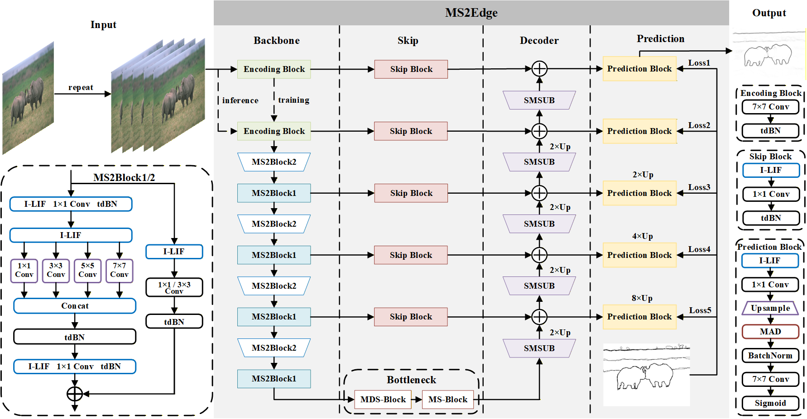

# 🚀 MS2Edge: Towards Energy-Efficient and Crisp Edge Detection with Multi-Scale Residual Learning in SNNs

<div align="center">



</div>

**Official PyTorch implementation of MS2Edge**
*Accepted by Pattern Recognition 2025*

[](https://doi.org/10.1016/j.patcog.2025.112883)


---

## 📋 Requirements

| Repository   | Version |
| ------------ | ------- |
| CUDA         | 11.7    |
| cuDNN        | V8.0.0  |
| Python       | 3.9.19  |
| Pytorch      | 2.0.1   |
| Torchvision  | 0.15.2  |
| Opencv       | 4.6.0   |
| SpikingJelly | 0.0.14  |

---

## 📦 Required Data

To evaluate or train MS2Edge you will need to download the datasets:

| Dataset Name          | Link                                                         |
| --------------------- | ------------------------------------------------------------ |
| BSDS500 Dataset       | [Download BSDS500 Dataset](https://www2.eecs.berkeley.edu/Research/Projects/CS/vision/grouping/resources.html) |
| NYUDv2 Dataset        | [Download NYUDv2 Dataset](https://www.kaggle.com/datasets/soumikrakshit/nyu-depth-v2) |
| BIPED Dataset         | [Download BIPED Dataset](https://xavysp.github.io/MBIPED/)   |
| PLDU and PLDM Dataset | [Download PLDU and PLDM Dataset](https://github.com/SnorkerHeng/PLD-UAV) |

---

## 🔧 Training and Evaluation

The training and evaluation pipeline can refer to:

- [PEdger](https://github.com/ForawardStar/PEdger)
- [DRC-Release](https://github.com/cyj5030/DRC-Release)

Specific parameters have been described in the paper.

---

## 📝 Citation

If you find this work useful, please cite it as:

```bibtex
@article{fan2025ms2edge,
    title     = {MS2Edge: Towards Energy-Efficient and Crisp Edge Detection with Multi-Scale Residual Learning in SNNs},
    author    = {Yimeng Fan and Changsong Liu and Mingyang Li and Yuzhou Dai and Yanyan Liu and Wei Zhang},
    journal   = {Pattern Recognition},
    pages     = {112883},
    year      = {2025},
    doi       = {https://doi.org/10.1016/j.patcog.2025.112883},
    publisher = {Elsevier}
}
```


